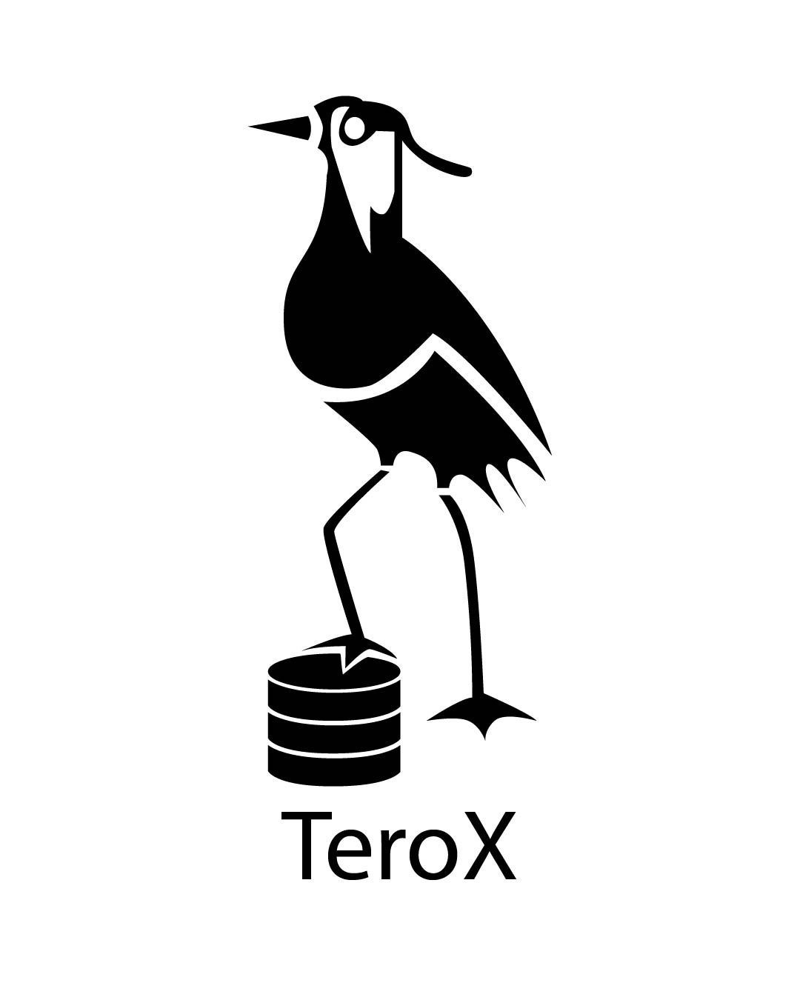

# TeroX

<p align="center">
  
</p>

## 📌 Propósito del sistema
TeroX es un sistema Marketplace que permite a los usuarios comprar y vender productos de manera segura y eficiente. Ofrece una plataforma intuitiva para la gestión de productos, usuarios y transacciones.


## 🚀 Instrucciones de uso

### Requisitos previos
- Node.js v18+
- TypeScript
- PostgreSQL 18+

### Instalación
#### Clonar el repositorio
```bash
git clone https://github.com/cozin101/TeroX.git;
cd TeroX;
```
#### Instalar dependencias
```bash
npm install;
```
#### Inicializar la base de datos para uso local
```bash
./recursos/inicializar-postgreSQL.sh;
```
#### Elegir modo de uso: producción (remoto) o local
```bash
npm run [produccion/local];
```
#### Iniciar la aplicación
```bash
npm run build;
npm run start;
```
